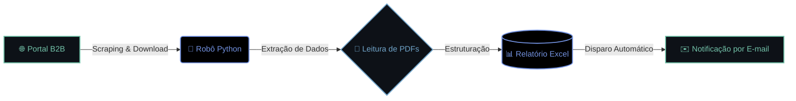

[...;>+Estruturando+pipelines+de+Dados...;>+Acesso+concedido.+Sistema+online.)](https://github.com/JFrois)

### Desenvolvedor Python | Automação (RPA) | Dados
*> Do Operacional à Engenharia: Resolvendo problemas complexos com tecnologia.*

---

### 👨‍💻 Sobre Mim

A minha trajetória profissional em grandes empresas como Loft, QuintoAndar e VOSS Automotive moldou o meu perfil de desenvolvedor: **não escrevo apenas código, crio soluções que resolvem dores reais do negócio.**

Com uma visão híbrida entre Operações e Tecnologia, especializei-me em identificar gargalos e construir ferramentas robustas para os solucionar. O meu foco é Engenharia de Software, utilizando Python tanto para Automação (RPA) quanto para Análise de Dados. O meu objetivo é atuar como solucionador de problemas, gerando eficiência operacional e valor estratégico.

### ⚙️ Arquitetura em Destaque: Robô Processador de Pedidos

Para ilustrar a minha abordagem à resolução de problemas, aqui está a arquitetura de uma das minhas soluções de RPA que eliminou horas de trabalho manual em portais B2B:

### 🚀 Projetos de Impacto

* 📊 **[Business Intelligence & Estratégia (Aftermarket)](https://github.com/JFrois/Analise-Aftermarket):** Aplicação corporativa (Python, Streamlit, SQL) para a VOSS Automotive. Cruza dados de clientes OEM para identificar oportunidades de venda no mercado de reposição, gerando leads qualificados.
* 🤖 **[Automação Desktop & RPA (Processador de Pedidos)](https://github.com/JFrois/RPA-Processamento_PDFs):** Aplicação Desktop completa descrita no fluxo acima. Estrutura dados críticos e gera relatórios consolidados.
* 🏭 **[Automação de Cadastro (TOTVS Protheus)](https://github.com/JFrois/Automacao-Cadastro-Previsao-Vendas):** Bot de RPA em Python para automatizar cadastros complexos em sistemas ERP.
* ⚖️ **[Envio de Novos Casos](https://github.com/JFrois/Envio-novos-casos---Python):** Projeto em Python + Zapier para consolidação de dados (ex.: ITBI) e envio automatizado.

---

### 💻 Stack Tecnológico e Ferramentas

  
<b>🛠️ Clica para ver as minhas Linguagens e Ferramentas</b>

 

       

      

---

### 📡 Telemetria em Tempo Real

*Gráfico dinâmico atualizado via GitHub Actions com o meu tempo de código e linguagens mais usadas na última semana.*

---

### 📊 Estatísticas do GitHub

  <picture>
    <source media="(prefers-color-scheme: dark)" srcset="https://raw.githubusercontent.com/JFrois/JFrois/output/github-snake-dark.svg">
    <source media="(prefers-color-scheme: light)" srcset="https://raw.githubusercontent.com/JFrois/JFrois/output/github-snake.svg">
    
  </picture>

---

### 🌐 Conexão Estabelecida

  
