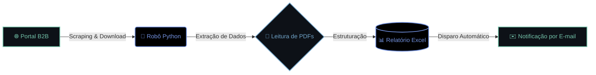

[...;>+Estruturando+pipelines+de+Dados...;>+Acesso+concedido.+Sistema+online.)](https://github.com/JFrois)

### Desenvolvedor Python | Automação (RPA) | Dados
*> Do Operacional à Engenharia: Resolvendo problemas complexos com tecnologia.*

---

### 👨‍💻 Sobre Mim

A minha trajetória profissional em grandes empresas como Loft, QuintoAndar e VOSS Automotive moldou o meu perfil de desenvolvedor: **não escrevo apenas código, crio soluções que resolvem dores reais do negócio.**

Com uma visão híbrida entre Operações e Tecnologia, especializei-me em identificar gargalos e construir ferramentas robustas para os solucionar. O meu foco é Engenharia de Software, utilizando Python tanto para Automação (RPA) quanto para Análise de Dados. O meu objetivo é atuar como solucionador de problemas, gerando eficiência operacional e valor estratégico.

### ⚙️ Arquitetura em Destaque: Robô Processador de Pedidos

Para ilustrar a minha abordagem à resolução de problemas, aqui está a arquitetura de uma das minhas soluções de RPA que eliminou horas de trabalho manual em portais B2B:

### 🚀 Projetos de Impacto

* 📊 **[Business Intelligence & Estratégia (Aftermarket)](https://github.com/JFrois/Analise-Aftermarket):** Aplicação corporativa (Python, Streamlit, SQL) para a VOSS Automotive. Cruza dados de clientes OEM para identificar oportunidades de venda no mercado de reposição, gerando leads qualificados.
* 🤖 **[Automação Desktop & RPA (Processador de Pedidos)](https://github.com/JFrois/RPA-Processamento_PDFs):** Aplicação Desktop completa descrita no fluxo acima. Estrutura dados críticos e gera relatórios consolidados.
* 🏭 **[Automação de Cadastro (TOTVS Protheus)](https://github.com/JFrois/Automa-o-de-Cadastro-de-Previs-o-de-Vendas---TOTVS-Protheus):** Bot de RPA em Python para automatizar cadastros complexos em sistemas ERP.
* ⚖️ **[Envio de Novos Casos](https://github.com/JFrois/Envio-novos-casos---Python):** Projeto em Python + Zapier para consolidação de dados (ex.: ITBI) e envio automatizado.

---

### 💻 Stack Tecnológico e Ferramentas

<b>🛠️ Clica para expandir as minhas Linguagens e Ferramentas</b>

 **Linguagens:**
    

**Bancos de Dados:**
  

**Ferramentas & DevOps:**
      

---

### 📊 Estatísticas do GitHub

<b>📈 Clique para expandir as estatísticas detalhadas</b>

 

  <table border="0">
    <tr>
      <td align="center" width="50%">
        <picture>
          <source media="(prefers-color-scheme: dark)" srcset="https://raw.githubusercontent.com/JFrois/JFrois/output/github-snake-dark.svg">
          <source media="(prefers-color-scheme: light)" srcset="https://raw.githubusercontent.com/JFrois/JFrois/output/github-snake.svg">
          
        </picture>
      </td>
      <td align="center" width="50%">
        
      </td>
    </tr>
  </table>

---

### 🌐 Conexões

  

<!-- ALURA:START -->

#### 📚 Cursos em Andamento
| Curso | Progresso |
| :--- | :---: |
| Linux I: conhecendo e utilizando o terminal | `[ 98% ]` |
| Python: começando com a linguagem | `[ 100% ]` |
| Python: avançando na linguagem | `[ 100% ]` |
| Comunicação: como se expressar bem e ser compreendido | `[ 2% ]` |
| Relacionamento interpessoal: aprenda a lidar melhor com você e com o outro | `[ 1% ]` |
| Oratória parte 2: apresentações em público | `[ 1% ]` |
| Comunicação não violenta: consciência para agir | `[ 0% ]` |
| Estatística com Python: frequências e medidas | `[ 8% ]` |
| Comunicação não violenta parte 2: mantendo a empatia | `[ 0% ]` |
| Storytelling: visão de negócios e desenvolvimento pessoal | `[ 2% ]` |
| Lógica de programação: comece em lógica com o jogo Pong e JavaScript | `[ 95% ]` |
| Lógica de programação: laços e listas com JavaScript | `[ 100% ]` |
| Comunicação assertiva: reduzindo conflitos e frustrações | `[ 0% ]` |
| Data Analysis: Google Sheets | `[ 100% ]` |
| Arquitetura de computadores: por trás de como seu programa funciona | `[ 100% ]` |
| Transição de carreira: um guia para a área da tecnologia | `[ 0% ]` |
| Data Analysis: previsões com Google Sheets | `[ 33% ]` |
| Ferramentas para agilidade: visão geral sobre controle de projetos e produtos | `[ 73% ]` |
| Dashboard com Tableau: conceitos essenciais | `[ 31% ]` |
| JavaScript para Web: Crie páginas dinâmicas | `[ 85% ]` |
| Tableau: construindo dashboards e histórias | `[ 1% ]` |
| Product Manager: uma jornada em gestão de produto | `[ 0% ]` |
| HTML e CSS: praticando HTML/CSS | `[ 89% ]` |
| Roadmap: como criar e manter o mapa de produto | `[ 100% ]` |
| Visão Computacional: reconhecimento de texto com OCR e OpenCV | `[ 8% ]` |
| HTML e CSS: ambientes de desenvolvimento, estrutura de arquivos e tags | `[ 92% ]` |
| HTML e CSS: Classes, posicionamento e Flexbox | `[ 87% ]` |
| HTML e CSS: cabeçalho, footer e variáveis CSS | `[ 86% ]` |
| HTML e CSS: trabalhando com responsividade e publicação de projetos | `[ 85% ]` |
| Python para Dados: primeiros passos | `[ 98% ]` |
| Python para Dados: trabalhando com funções, estruturas de dados e exceções | `[ 69% ]` |
| SQLite online: conhecendo instruções SQL | `[ 92% ]` |
| Comunicação: como se expressar bem e ser compreendido | `[ 21% ]` |
| Excel: domine o editor de planilhas | `[ 2% ]` |
| Lógica de programação: mergulhe em programação com JavaScript | `[ 92% ]` |
| Lógica de programação: explore funções e listas | `[ 97% ]` |
| Figma: conhecendo a ferramenta | `[ 97% ]` |
| Git e GitHub: compartilhando e colaborando em projetos | `[ 96% ]` |
| Lógica de programação: praticando com desafios | `[ 65% ]` |
| Python: crie a sua primeira aplicação | `[ 98% ]` |
| Python: aplicando a Orientação a Objetos | `[ 97% ]` |
| Python: avance na Orientação a Objetos e consuma API | `[ 65% ]` |
| Scripting: automação de tarefas com Python e criação de Pipelines no Jenkins | `[ 2% ]` |
| Começando em Programação: carreira e primeiros passos | `[ 100% ]` |
| Praticando Python: laços for e while | `[ 100% ]` |
| Praticando Python: condicionais if, elif e else | `[ 100% ]` |
| Pensamento computacional: fundamentos da computação e lógica de programação | `[ 73% ]` |
| Carreira Cientista de Dados: Boas-vindas e primeiros passos | `[ 100% ]` |
| Carreira Análise de Dados: Boas-vindas e primeiros passos | `[ 95% ]` |
| Carreira Desenvolvimento Back-End Python: Boas-vindas e primeiros passos | `[ 100% ]` |

#### 🎓 Formações e Planos de Estudo
| Trilha de Estudo | Tipo | Cursos Concluídos |
| :--- | :--- | :---: |
| Data Analysis com Google Sheets | Degree | `1 de 4` |
| Data Science | Degree | `0 de 5` |
| Data-driven UX: coletando e analisando dados de um produto | Degree | `0 de 3` |
| Análise de Dados | Carreira | `1 de 59` |
| Ciência de Dados | Carreira | `1 de 70` |

<!-- ALURA:END -->